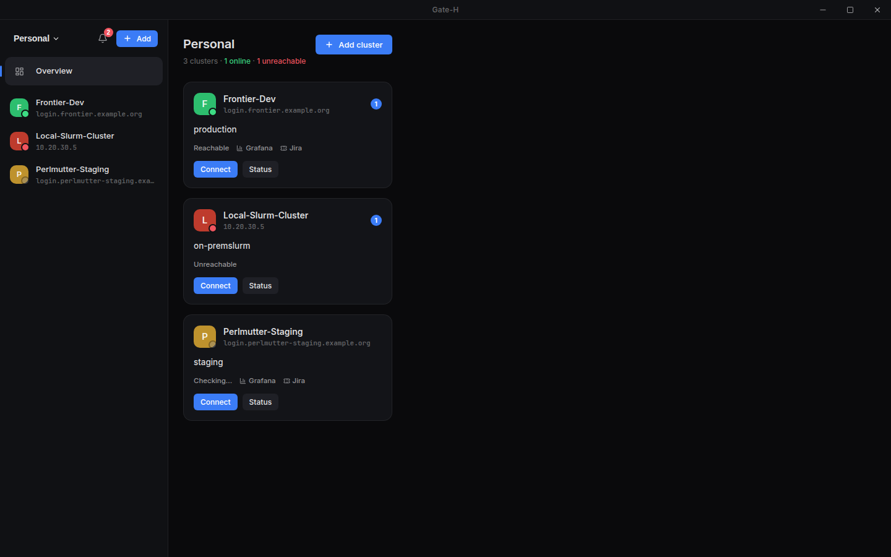
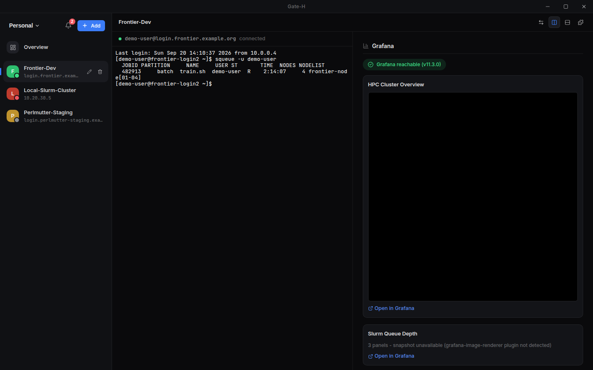
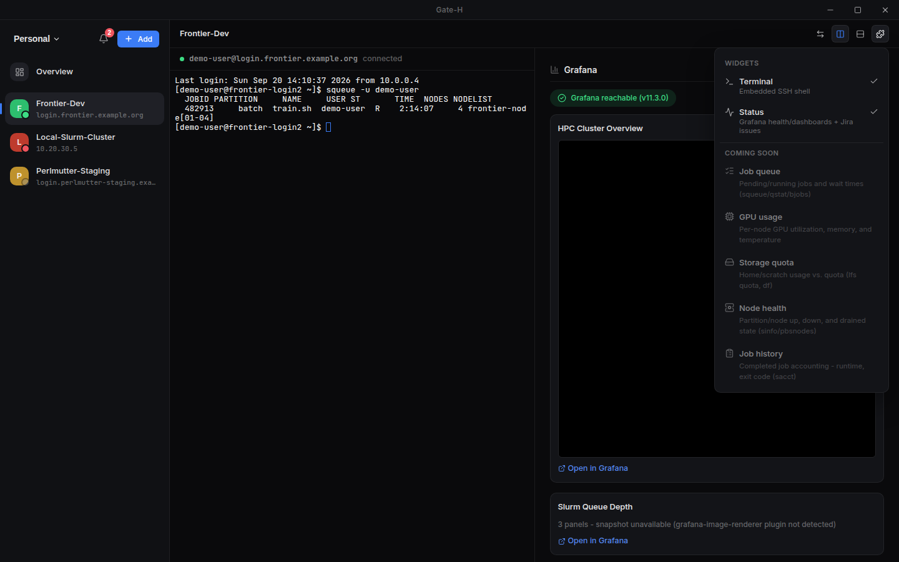
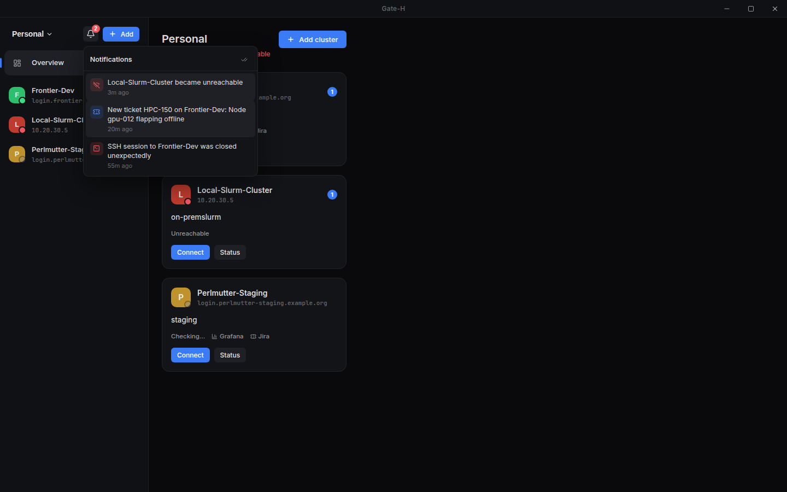
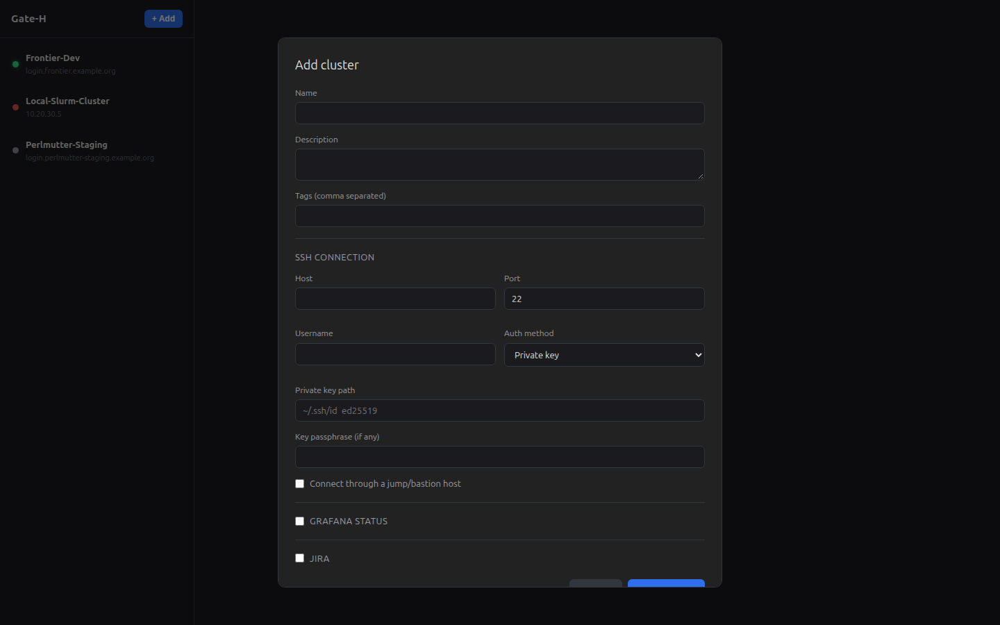
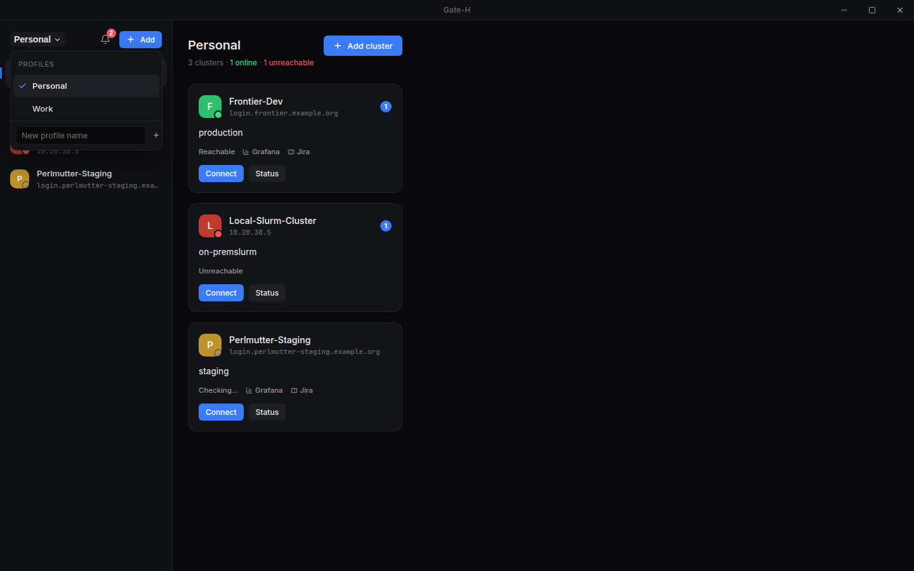
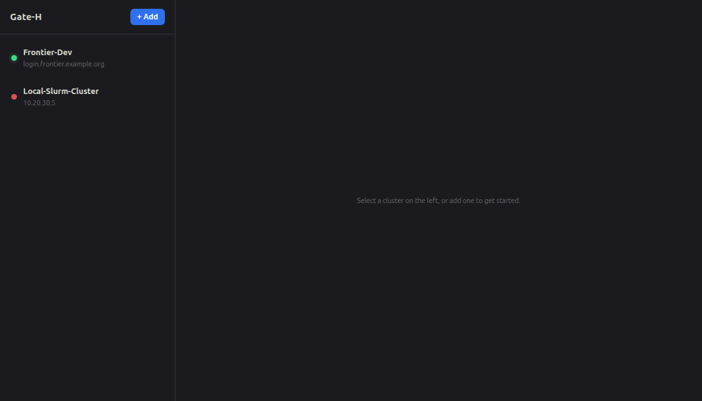

<p align="center">
  
</p>

<p align="center">
  <a href="LICENSE"></a>
  
  
  <br/>
  
  
  
  
</p>

<p align="center">
  <b>A desktop app for running several HPC clusters from one window: SSH, Grafana status, and Jira.</b><br/>
  No server to deploy, no browser tabs, no telemetry.
</p>

---

**Jump to:** [🚀 Quick start](#-quick-start) · [Everyday use](#everyday-use) · [Troubleshooting](#troubleshooting) · [Features](#features) · [For developers](#for-developers) · [Documentation](#documentation)

## 🚀 Quick start

**① Install.** You need Linux and [Docker](https://docs.docker.com/engine/install/).

```bash
git clone git@github.com:AhmedYousriSobhi/gate-h.git && cd gate-h
./build-desktop.sh && ./dist/Gate-H-*.AppImage
```

**② Add a cluster.** Click **+ Add**, give it a name, fill in *SSH connection* (see below), and
click **Save cluster**.

**③ Open it.** Click the cluster in the sidebar. Its terminal and status open side by side.

### How do you reach your cluster?

Pick the way you'd normally connect, and open it to see what to fill in.

<details>
<summary><b>🔑 Directly</b> — <code>ssh user@host</code></summary>

<br/>

| Field | Enter |
|---|---|
| **Host** / **Port** | the login node, e.g. `login.hpc.example.org` / `22` |
| **Username** | your cluster username |
| **Auth method** | **Private key** (path + passphrase), **Password**, or **SSH agent** |

Passwords and passphrases are encrypted with your OS keychain. The first time you connect,
Gate-H remembers the server's host key and warns you if it ever changes.

</details>

<details>
<summary><b>🪜 Through a jump host</b> — <code>ssh -J jump user@host</code></summary>

<br/>

1. Fill in the login node as for **Directly**.
2. Tick **Connect through a jump/bastion host**, then enter the jump host's address, port,
   username and auth method.

A jump host can reuse the cluster's password or passphrase only if both use the same auth method.

</details>

<details>
<summary><b>☁️ Through Azure</b> — Azure Bastion or <code>az ssh vm</code></summary>

<br/>

**You need:** the [Azure CLI](https://learn.microsoft.com/cli/azure/install-azure-cli) (`az`), and
either Azure Bastion (Standard/Premium SKU, *Native client support* on) or a VM you can reach with
`az ssh vm`.

1. Under *SSH connection*, enter the tunnel's **far end**, not `127.0.0.1`: the target VM
   (Bastion), or the login node as the VM sees it (`az ssh vm`). Leave the jump host unticked.
2. Tick **Azure tunnel** and fill in:

   | Field | Enter |
   |---|---|
   | **Tunnel through** | Azure Bastion, or VM via `az ssh vm` |
   | **Local port** | any free port, e.g. `2222` |
   | **Subscription** | click **Load from az** and pick one |
   | **Resource group** | the Bastion's or VM's resource group |
   | **Bastion name** + **Target VM resource ID** | Bastion only |
   | **VM name** (+ optional **Local VM user**) | `az ssh vm` only |

3. Select the cluster. If Azure needs you to sign in, the terminal shows a code to enter in your
   browser. Then it opens the tunnel and connects.

💡 Run your shell in `tmux new -A -s main` so a dropped connection doesn't lose your work.
More: [docs/AZURE.md](docs/AZURE.md).

</details>

<details>
<summary><b>🛡️ Behind Teleport</b> — <code>tsh login</code> then <code>tsh ssh user@node</code></summary>

<br/>

**You need:** the Teleport client (check with `tsh version`), and from your admin the proxy
address, your Teleport user, and the node name. First time with a password? Open your invite link,
set a password, and scan the QR code into an authenticator app.

1. Tick **Behind Teleport** and fill in:

   | Field | Enter |
   |---|---|
   | **Proxy address** | e.g. `teleport.example.com:443` |
   | **Teleport user** | only if it differs from your OS username |
   | **Leaf cluster** / **Auth connector** | only if your admin gave you one |
   | **Teleport node name** | the node as `tsh ls` shows it, e.g. `slogin1` |
   | **Login** | your Linux account on that node |

2. Select the cluster:
   - **Already logged in:** your shell opens straight away.
   - **Not logged in:** the terminal shows **Teleport login needed**. Click **Log in**, then
     finish single sign-on in your browser, or enter your password and 6-digit code. Every
     cluster behind the same proxy reconnects.
3. About 15 minutes before your login expires, you get a notification and a **Renew** button in
   the terminal's status bar, so you can renew it whenever suits you.

💡 Proxy uses your organisation's own CA? Start Gate-H with `SSL_CERT_FILE=/path/to/ca.pem`.
More: [docs/TELEPORT.md](docs/TELEPORT.md).

</details>

## Why Gate-H

If you look after more than one HPC cluster, you know the routine: a terminal for each login
node, a Grafana tab for each cluster's dashboards, a Jira board somewhere else. Then the VPN
drops, and you have to work out which of those things are still alive.

Gate-H puts all of that in one desktop window. You register each cluster once, with its SSH
access, its Grafana dashboards and its Jira project. After that:

- every cluster sits in a sidebar, with a light showing whether it's reachable,
- clicking a cluster opens its terminal and its status side by side,
- one notification feed tells you when anything changes on any cluster.

It's a single-user app with no server to set up. It's also careful with shared infrastructure:
reconnects are limited and spaced out, so a cluster that's down never gets flooded with
connection attempts. Secrets are encrypted on disk.

## Features

- 🖥️ **All your clusters in one sidebar.** Each has its own SSH settings: password, key or
  agent, with an optional jump host.
- 🟢 **Live reachability.** A light per cluster, checked in the background and re-checked as soon
  as the window regains focus.
- ⌨️ **Built-in terminal.** Host keys are remembered on first use. Dead connections are
  detected, reconnects are limited and spaced out, and the terminal makes it obvious when a
  session isn't live. Search the scrollback, and click links to open them.
- 🗔 **Multiple sessions per cluster, VS Code-style.** Open as many terminal sessions as you
  need, each named after what its shell reports (like `user@host: ~/logs`) and with its own live
  status dot. Rename them, reorder them, and drag them together to
  watch several at once. Arrange them in any grid, such as two side by side above a third: drag a
  tab, or a session's header bar, onto an edge of another session to place it there, then drag
  the borders between sessions to resize them.
- ☁️ **Azure clusters.** For clusters behind Azure Bastion or `az ssh vm`, Gate-H signs in with
  the Azure CLI and opens the tunnel for you.
- 🛡️ **Teleport clusters.** For clusters behind a Teleport proxy, Gate-H checks your `tsh`
  session and connects with `tsh ssh`. If you need to log in, you do it right in the terminal.
- 📊 **Grafana status.** Health checks plus live panels you choose, stacked or side by side.
- 🎫 **Jira, Cloud or Data Center.** List a cluster's issues and file new ones from its view.
- 🧩 **Widgets side by side.** Show, hide, swap, stack and resize the terminal and status views.
  Your layout is remembered.
- 🔔 **One notification feed.** Reachability changes, Jira activity and dropped sessions from
  every cluster. Click one to jump to it.
- 🗂️ **Profiles and an overview.** Group clusters into profiles such as "Work" and "Research".
  The home screen shows every cluster in the current profile.
- ⏸️ **Pin or pause a cluster.** Keep a session alive in the background, or put a cluster in
  standby so it makes no connections at all.

## Preview

<p align="center">
  <br/>
  <sub>The default view: every cluster in the active profile, with reachability, tags,
  integrations, and unread notifications at a glance.</sub>
</p>

<p align="center">
  <br/>
  <sub>A cluster's Terminal and Status side by side, not tabs - toggle, swap, or stack them from
  the toolbar.</sub>
</p>

<table>
<tr>
<td width="50%" align="center">
  <br/>
  <sub>Toggle widgets on/off; disabled entries preview what's planned next</sub>
</td>
<td width="50%" align="center">
  <br/>
  <sub>One bell for reachability, Jira, and session events across every cluster</sub>
</td>
</tr>
<tr>
<td width="50%" align="center">
  <br/>
  <sub>Register a cluster: SSH, optional jump host, Grafana, Jira</sub>
</td>
<td width="50%" align="center">
  <br/>
  <sub>Switch profiles, or add/rename/delete one, from the sidebar</sub>
</td>
</tr>
</table>

### Procedures

<table>
<tr>
<td align="center">
  <b>Add a cluster</b><br/><br/>
  
</td>
<td align="center">
  <b>Connect over SSH</b><br/><br/>
  
</td>
<td align="center">
  <b>Status + file a Jira ticket</b><br/><br/>
  
</td>
</tr>
</table>

> These were captured by driving the real UI code in a headless browser against sample data (this
> environment can't open an actual Electron window) — see [docs/STATUS.md](docs/STATUS.md) for
> exactly how, and what's still unverified against real infrastructure.


## Everyday use

| I want to… | Do this |
|---|---|
| see all clusters at a glance | Open **Overview** at the top of the sidebar |
| rearrange a cluster's widgets | Use the toolbar above them; the puzzle-piece icon shows or hides each one |
| see what changed anywhere | Click the 🔔 bell; click an entry to jump to that cluster |
| separate work and research clusters | Click the profile name at the top of the sidebar |
| keep a session alive in the background | Hover the cluster in the sidebar → **pin** icon |
| stop all connections to a cluster | Hover it → **power** icon (standby); select it → **Resume monitoring** to restart |
| open another terminal session | Click **+** above the session tabs |
| watch two sessions at once | Click the split icon next to **+**, or press **Ctrl+Shift+5** in a terminal |
| put a session beside, above or below another | Drag its tab or its header bar onto that edge of the other session; the highlighted half shows where it lands |
| resize sessions shown together | Drag the border between them |
| reorder tabs, or stack two into one view | Drag a tab onto the edge of another tab to reorder, or onto its middle to stack them |
| move tabs between the side and the top | Click **⋯** above the tabs → **Tabs position** |
| rename, split, unstack or close a session | Right-click its tab or the session itself (or double-click the tab to rename) |
| focus on one session in a stack for a while | Click **Maximize** in its header; **Restore** brings the layout back |
| split or close a session from where you're looking | Use the icons on the right of its header bar |

**Terminal shortcuts:** **Ctrl+Shift+C** / **Ctrl+Shift+V** copy and paste (plain **Ctrl+C**
still interrupts). **Ctrl+F** searches the scrollback. **Ctrl+Tab** / **Ctrl+Shift+Tab** switch
sessions. **Ctrl+Shift+5** splits. On macOS, use **Cmd** instead of **Ctrl**.

## Troubleshooting

| Problem | Try |
|---|---|
| The light stays red | Check your VPN, and that you can reach the host (or Teleport proxy) from this machine. |
| The terminal says *Paused* | Gate-H stopped retrying to spare the cluster. Click **Reconnect now**, or wait: it resumes by itself when the light turns green. |
| *Host key … changed* notification | The server's key changed since your last connection. Ask your cluster admin before trusting it. |
| Azure: a sign-in code appears | Your Azure login expired. Open the link and enter the code. |
| Teleport: *unreachable* or *no route to host* | Your machine can't reach the proxy. Check the VPN and the proxy address. |
| Teleport: *certificate signed by unknown authority* | Start Gate-H with `SSL_CERT_FILE` pointing at your organisation's CA file. |
| Teleport: *login needed* on a cluster you didn't open | Pinned clusters never log in on their own. Log in from any cluster on that proxy; the rest reconnect. |
| Teleport: *access denied* | Your Teleport role doesn't allow that login or node. Run `tsh status` to see your logins. |

## For developers

### Run from source

```bash
npm install       # Node.js 20+; also builds the native modules for Electron
npm run dev       # start Gate-H with hot reload
```

Before opening a pull request, run `npm run typecheck`, `npm run lint` and `npm run build`. To
test a single part: `./scripts/test-azure-tunnel.sh`, `./scripts/test-teleport.sh` and
`node scripts/test-pty-manager.mjs`.

### How it's built

Gate-H is an Electron app with three strictly separated processes:

```
src/
  shared/     # types shared by all processes, incl. the GateHApi contract for window.api
  main/       # main process: SQLite store, SSH and PTY sessions, Grafana/Jira clients,
              # background monitors, one IPC handler file per namespace
  preload/    # the only bridge: a contextBridge API exposed as window.api
  renderer/   # React UI, grouped by feature: shell, terminal, status, clusters
```

- **The renderer has no Node or Electron access.** Everything goes through `window.api`, defined
  in [src/shared/types.ts](src/shared/types.ts).
- **Secrets are write-only.** They're encrypted with `electron.safeStorage` (your OS keychain),
  and the renderer only ever learns whether one is set.
- **State lives in SQLite** (`better-sqlite3`). Migrations only add columns and run at every
  launch.
- **Terminals** are rendered with `@xterm/xterm`. SSH and Azure clusters use an `ssh2` channel.
  Teleport clusters run `tsh ssh` on a local pseudo-terminal (`node-pty`), because `ssh2` can't do
  Teleport's certificate auth.
- **Fonts and icons ship with the app,** so the UI never needs the network just to render.

### Contributing

Each change starts as a GitHub issue and gets its own branch and pull request. [CLAUDE.md](CLAUDE.md)
has the commands, the code map, the conventions and the known gotchas.

## Documentation

| Document | What's in it |
|---|---|
| [docs/TELEPORT.md](docs/TELEPORT.md) | Teleport clusters: the session check, login, routing, and testing. |
| [docs/AZURE.md](docs/AZURE.md) | Azure tunnels: how they stay alive, investigating drops, the script on its own, and testing. |
| [docs/JIRA_GUIDE.md](docs/JIRA_GUIDE.md) | Jira setup, and keeping several clusters' tickets apart in one project. |
| [docs/STATUS.md](docs/STATUS.md) | What's shipped, how each feature was verified, known limitations, and the roadmap. |
| [SPEC.md](SPEC.md) | The functional spec, written as requirements. |
| [docs/ANALYSIS.md](docs/ANALYSIS.md) | Prior art (Open OnDemand, ColdFront/XDMoD, Slurm-web, …) and the reasons behind the design. |
| [CHANGELOG.md](CHANGELOG.md) | Every change, in order, and why. |

## License

[MIT](LICENSE) © 2026 Ahmed Yousri Sobhi
