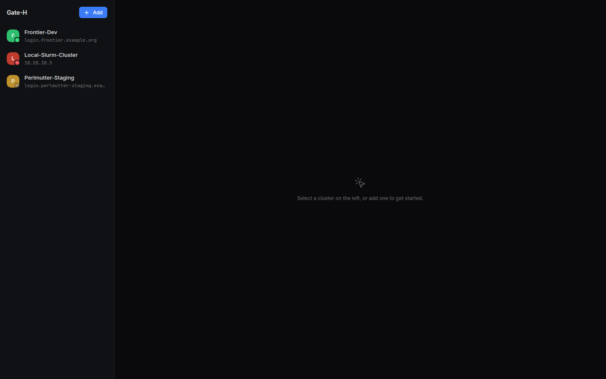
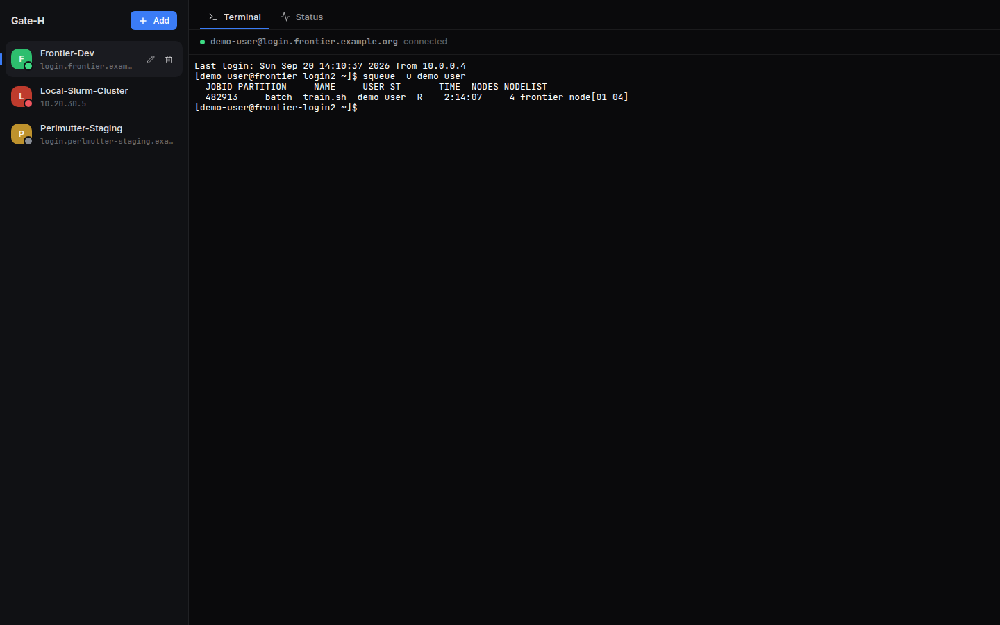
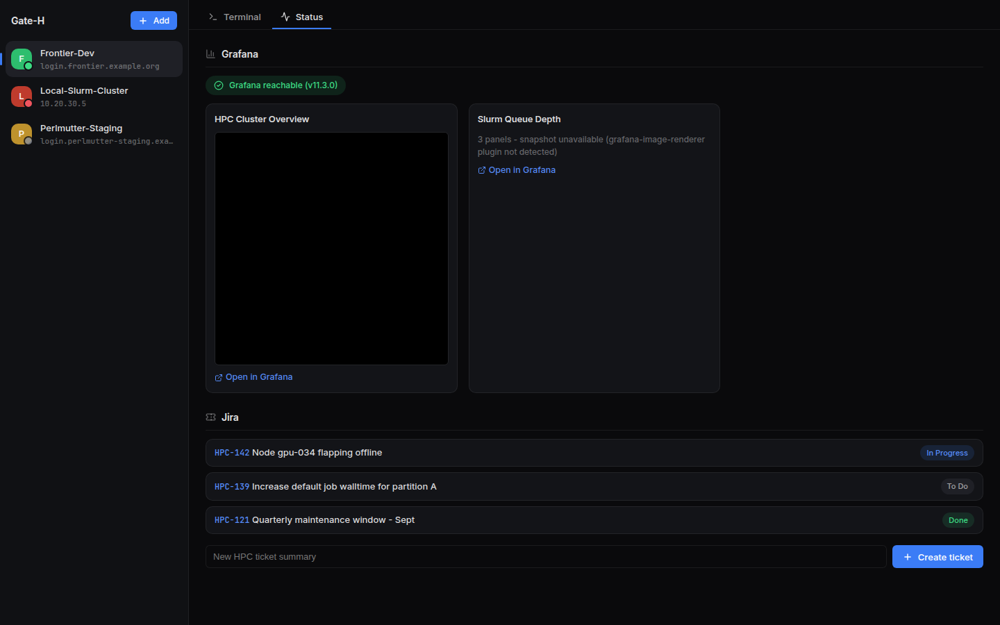

<p align="center">
  
</p>

<h1 align="center">Gate-H</h1>

<p align="center">
  A standalone desktop app (not a browser app) for managing HPC workloads across multiple
  clusters, from a single Linux desktop.
</p>

## What it does

- **Multi-cluster management** — register any number of HPC clusters, each with its own SSH
  connection profile (host, port, user, auth method, optional jump/bastion host), always visible
  in a sidebar so switching between clusters never means losing your place.
- **Live reachability monitoring** — every registered cluster is continuously checked in the
  background; a colored LED next to its name shows at a glance whether it's currently reachable.
- **Connect & operate** — open an SSH session (embedded terminal) to any registered cluster
  without leaving the app.
- **Live status via Grafana** — pull cluster health and dashboard snapshots from each cluster's
  Grafana instance using the Grafana REST API.
- **Jira integration** — view matching issues and file new tickets against a cluster's Jira
  project, for both Jira Cloud and Jira Data Center/Server.
- **Cross-cluster notifications** — a bell icon collects reachability changes, new/updated Jira
  tickets, and unexpected SSH disconnects from every cluster in one place, so you don't have to
  click into each one to notice something changed. Clicking a notification jumps straight to the
  relevant cluster and tab.

## Preview

<p align="center">
  <br/>
  <sub>Every cluster in a persistent sidebar - the colored dot shows live reachability - with a
  main panel for whichever one you're working on.</sub>
</p>

<table>
<tr>
<td width="50%" align="center">
  <br/>
  <sub>Connect over SSH - the sidebar stays put</sub>
</td>
<td width="50%" align="center">
  <br/>
  <sub>Grafana health/snapshots + Jira issues, per cluster</sub>
</td>
</tr>
<tr>
<td width="50%" align="center">
  <br/>
  <sub>One bell for reachability, Jira, and session events across every cluster</sub>
</td>
<td width="50%" align="center">
  <br/>
  <sub>Register a cluster: SSH, optional jump host, Grafana, Jira</sub>
</td>
</tr>
</table>

### Procedures

<table>
<tr>
<td align="center">
  <b>Add a cluster</b><br/><br/>
  
</td>
<td align="center">
  <b>Connect over SSH</b><br/><br/>
  
</td>
<td align="center">
  <b>Status + file a Jira ticket</b><br/><br/>
  
</td>
</tr>
</table>

> These were captured by driving the real UI code in a headless browser against sample data (this
> environment can't open an actual Electron window) — see [docs/STATUS.md](docs/STATUS.md) for
> exactly how, and what's still unverified against real infrastructure.

## Get the app

The reproducible way to get a runnable Gate-H, no local Node/toolchain setup required — just
[Docker](https://docs.docker.com/engine/install/):

```bash
./build-desktop.sh
./dist/Gate-H-*.AppImage
```

`build-desktop.sh` builds a pinned Node + native-module toolchain image, then builds and packages
Gate-H inside a container from it — the same result on any machine, regardless of what's installed
locally. See [docker/build.Dockerfile](docker/build.Dockerfile) for exactly what's in that image.

Then, inside the app:

1. Click **+ Add** in the sidebar and fill in a name plus its SSH connection details (host, user,
   auth method). Grafana and Jira are optional per cluster.
2. Click a cluster in the sidebar to open its embedded SSH **Terminal** tab - the sidebar (and its
   live reachability LEDs) stays visible the whole time, so switching clusters is just a click.
3. Switch to its **Status** tab to see Grafana health/dashboards and Jira issues, and to file a
   new ticket.

## Development

For active development (with hot reload), run Gate-H directly with Node instead — Docker doesn't
give you a GUI window, so it's only used for reproducible packaging above, not for `dev`:

```bash
npm install       # install dependencies (Node.js 20+ required)
npm run dev       # launch Gate-H in development mode
```

Other useful scripts: `npm run lint`, `npm run typecheck`, `npm run build`.

## Tech stack

- **Shell**: Electron (Linux-first; cross-platform later if needed)
- **UI**: React + TypeScript, bundled with Vite (`electron-vite`); Inter (UI text) and JetBrains
  Mono (hostnames/code), both self-hosted via `@fontsource*` so the app never depends on network
  access just to render its own typography; icons from `lucide-react`
- **SSH / terminal**: `ssh2` (SSH client, password/key/agent auth, jump-host chaining) +
  `@xterm/xterm` for the embedded terminal (no local PTY needed - every session is a remote SSH
  channel)
- **Secrets**: `electron.safeStorage` (OS keychain-backed, e.g. libsecret on Linux) - SSH
  passphrases and Grafana/Jira API tokens are encrypted at rest and never sent back to the
  renderer once saved
- **Local persistence**: `better-sqlite3` for cluster/profile configuration
- **Integrations**: Grafana HTTP API (service-account token), Jira REST API (Cloud: email + API
  token; Data Center: Personal Access Token)

Project layout:

```
src/
  shared/     # types shared between main and renderer (over the preload bridge)
  main/       # Electron main process — SSH sessions, SQLite store, Grafana/Jira HTTP calls
  preload/    # contextBridge API exposed to the renderer
  renderer/   # React UI (sidebar + panel shell, terminal, Grafana/Jira status)
```

## Learn more / project status

This README stays focused on what Gate-H is and how to run it. For anything deeper:

- **[docs/JIRA_GUIDE.md](docs/JIRA_GUIDE.md)** — step-by-step Jira setup, and how to keep multiple
  clusters' tickets from bleeding into each other when they share one Jira project (plus where
  Confluence currently stands: not integrated yet).
- **[docs/STATUS.md](docs/STATUS.md)** — current feature completeness, how each feature has been
  verified so far, and known limitations/roadmap.
- **[CHANGELOG.md](CHANGELOG.md)** — the chronological build log: every change, in the order it
  happened, and why.
- **[docs/ANALYSIS.md](docs/ANALYSIS.md)** — prior-art research (Open OnDemand, ColdFront/XDMoD,
  Slurm-web, etc.) and the architecture decisions behind Gate-H.

Each feature is developed on its own `feature/*` branch and merged into `main` once it builds,
lints, and typechecks cleanly.
