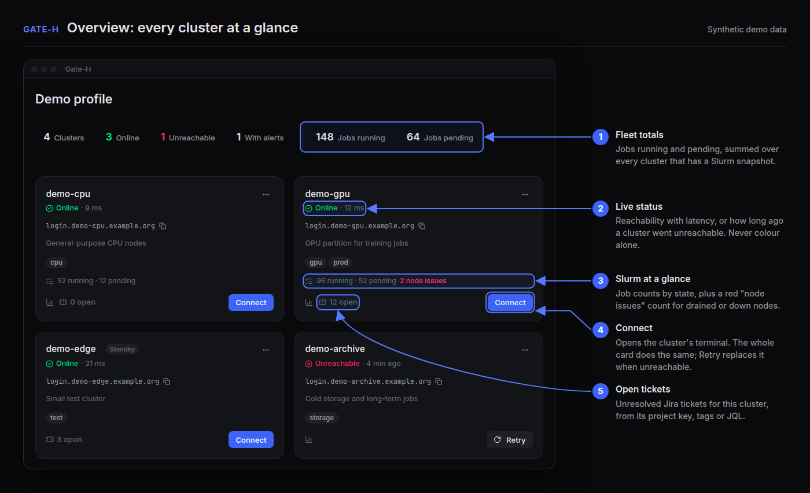
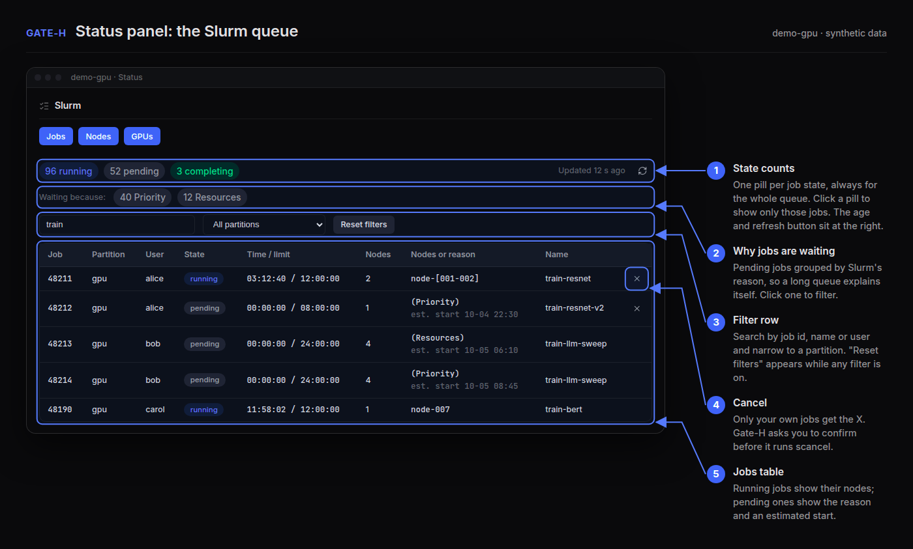
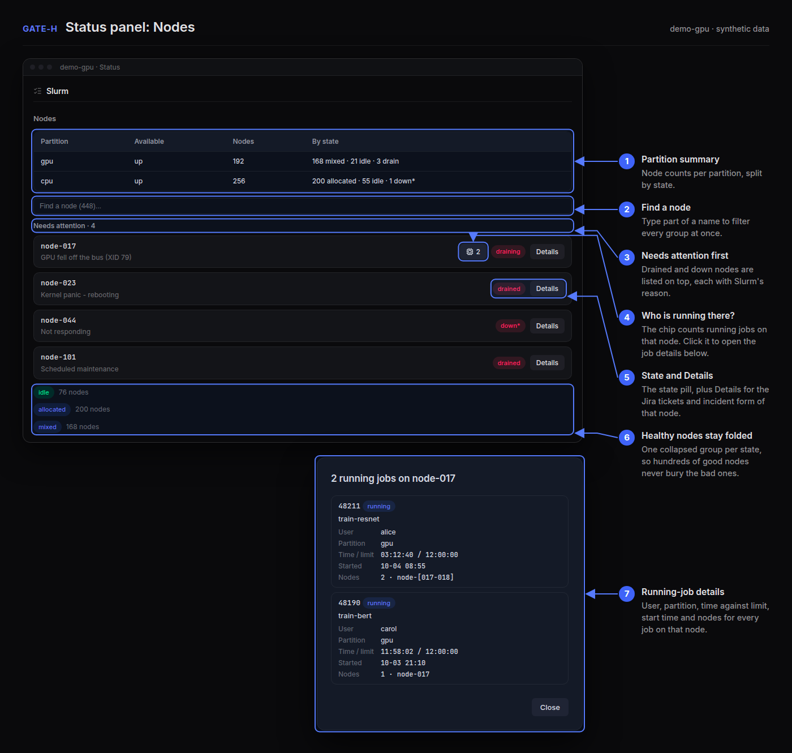
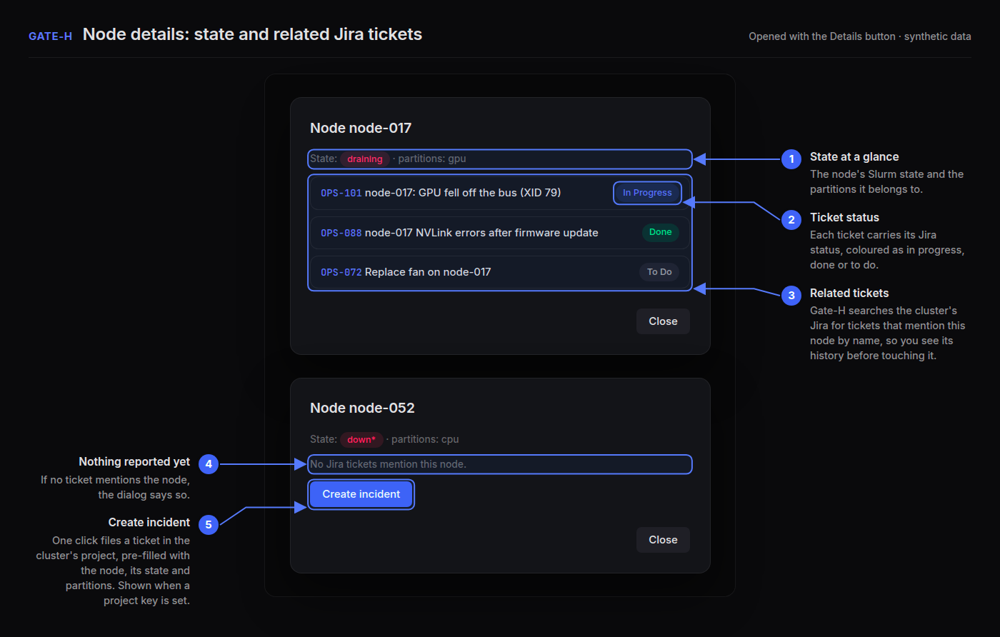
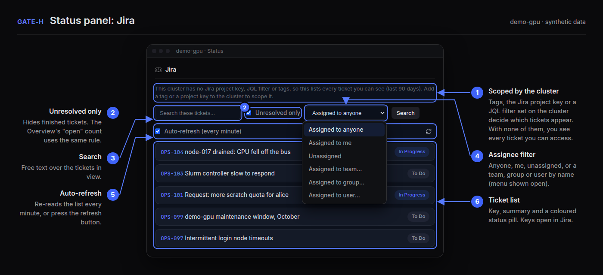
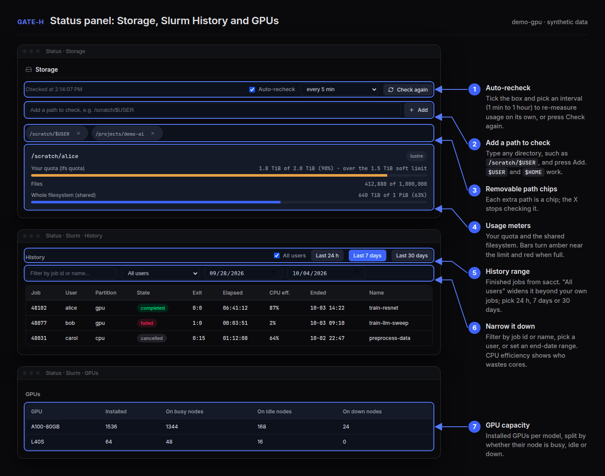
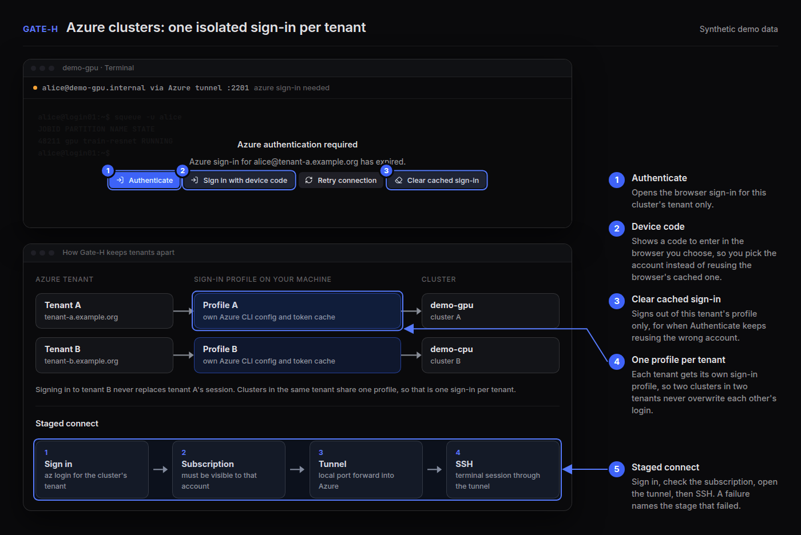
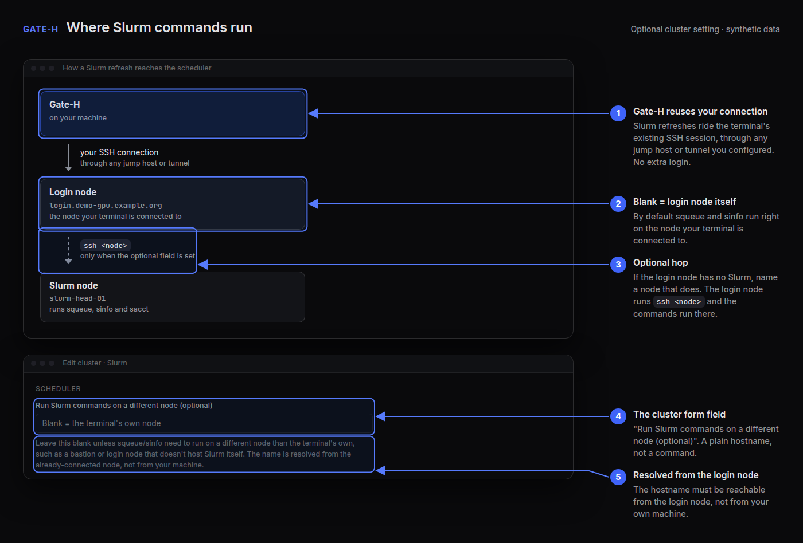

<p align="center">
  
</p>

<p align="center">
  <a href="https://github.com/AhmedYousriSobhi/gate-h/releases"></a>
  
  
  <a href="LICENSE"></a>
</p>

<h3 align="center">Your HPC clusters, in one window.<br/>Terminal, Slurm, GPUs, files and tickets, side by side.</h3>

<p align="center">
  A desktop app, not a service you host. Point it at a login node you can already <code>ssh</code>
  into, plus its Grafana and Jira if your site has them. It doesn't provision, schedule or
  administer anything: it only connects to clusters that already exist.
</p>

<p align="center">
  
</p>

## What you get

| | |
|---|---|
| 🖥️ **Terminals that stay up** | Any number of tabs and splits per cluster. Sessions reconnect on their own, with limits, so a down cluster isn't flooded. |
| 📋 **Slurm at a glance** | Live queue with filters, why jobs are waiting, job history, and node health with the problems listed first. |
| 🛠️ **Node triage** | Drained and down nodes with their reasons, the jobs still running on them, and the Jira tickets that mention them. |
| 🎛️ **GPUs and storage** | Installed GPUs by node state, live utilization through Grafana, and storage quota you can point at any path and recheck automatically. |
| 🎫 **Jira per cluster** | Open-ticket counts on the overview, a ticket list scoped by the cluster's tags, filtered by assignee, team or text. |
| ☁️ **Azure and Teleport** | One sign-in profile per Azure tenant, so clusters in different tenants run at the same time. |
| 🔔 **One bell** | A job finished, a node went down, a session dropped. |

## Tour

### 1 · See every cluster at once
The overview shows each cluster's reachability, its Slurm summary, and how many Jira tickets are
still open. Counts come from data the app already has, so the overview adds no polling of its own.

### 2 · Know why your jobs wait
<p align="center">
  
</p>

Each pending reason (`Priority`, `Resources`, …) is a count you can click to filter the table.
Search by job id, name or user, and narrow by partition. Partitions in the cluster settings are
optional: the app lists the whole queue and you filter in the panel.

### 3 · Fix the right nodes first
<p align="center">
  
</p>

Down and drained nodes come first, each with its drain reason. A small CPU badge means jobs are
still running there, and clicking it shows them. Healthy nodes fold into one group per state, and
a search box finds any node by name. Node health is always cluster-wide, whatever partition you
filter on.

<p align="center">
  
</p>

**Details** lists the Jira tickets that mention the node and files a new incident when none do.

### 4 · Tickets scoped to the cluster
<p align="center">
  
</p>

Set a project key or JQL on the cluster, or just give the cluster **tags**: they match a ticket's
labels or text. Then filter by assignee, group or team, hide resolved tickets, and let it refresh
every minute.

### 5 · Storage, history and GPUs
<p align="center">
  
</p>

Type a path into the Storage panel and it's checked next to the configured ones, then rechecked on
the interval you pick. History filters by job id, name, user and date, and **All users** shows
everyone's jobs when your own name doesn't match the accounting records.

### 6 · Two Azure tenants, one window
<p align="center">
  
</p>

Each tenant gets its own Azure CLI profile, so signing into one never replaces the other. Connecting
runs in stages (sign-in, subscription, tunnel, SSH banner), and **Sign in with device code** lets
you pick the account instead of reusing the browser's cached one.

### 7 · Slurm lives on another node?
<p align="center">
  
</p>

Leave **Run Slurm commands on a different node** blank and Slurm is read from the node you
connect to. Fill it in and the app runs `ssh <node>` from that login node, using its own keys.

## Install

**Linux** (needs [Docker](https://docs.docker.com/engine/install/)):

```bash
git clone git@github.com:AhmedYousriSobhi/gate-h.git && cd gate-h
./build-desktop.sh && ./dist/Gate-H-*.AppImage
```

**macOS** (Apple Silicon or Intel; needs Node 22 and `xcode-select --install`):

```bash
git clone git@github.com:AhmedYousriSobhi/gate-h.git && cd gate-h
./build-desktop.sh && open dist/*.dmg
```

Or take the `.dmg` from [Releases](https://github.com/AhmedYousriSobhi/gate-h/releases) (`arm64` is
Apple Silicon, `x64` is Intel). It isn't notarized yet, so the first launch needs **System Settings
→ Privacy & Security → Open Anyway**.

## Connect a cluster

Click **+ Add**, name it, then pick how you reach it. SSH access to a login node is the only hard
requirement. Grafana, Jira, Azure and Teleport are optional, per cluster.

| Route | You fill in | More |
|---|---|---|
| 🔑 Directly | host, port, user, key / password / agent | [GUIDE](docs/GUIDE.md#-quick-start) |
| 🪜 Jump host | the above, plus the jump host's address and login | [GUIDE](docs/GUIDE.md#-quick-start) |
| ☁️ Azure | subscription, resource group, Bastion or `az ssh vm` target (needs `az`) | [AZURE](docs/AZURE.md) |
| 🛡️ Teleport | proxy, node name, login (needs `tsh`) | [TELEPORT](docs/TELEPORT.md) |

## Safe near a real cluster

- **Polite.** Slurm, GPU and file features reuse your open session and poll only while you're
  looking. Reconnects are capped and spaced out.
- **Private.** No server, no account, no telemetry. Passwords and tokens sit in your OS keychain
  and are never handed back to the UI.
- **Careful.** Host keys are pinned and a change blocks the connection. Submitting and cancelling
  jobs ask first. The window is sandboxed and only the app's own page can call its internals.

## Known gaps

Not started: automated test suite, Confluence, drain/resume from the UI, GPU low-use alerts,
notarized macOS builds, Windows builds. Known bugs and limits, such as Azure Bastion allowing one
connection at a time: [docs/STATUS.md](docs/STATUS.md#known-issues-and-not-started). The HPC
features haven't been tried against every Slurm, Lustre, GPFS or DCGM setup, so reports from real
clusters are welcome.

## Docs

| You want to… | Read |
|---|---|
| set up a cluster or look up a feature or shortcut | [docs/GUIDE.md](docs/GUIDE.md) |
| use Azure Bastion / `az ssh vm`, or fix a dropped tunnel | [docs/AZURE.md](docs/AZURE.md) |
| use a Teleport proxy | [docs/TELEPORT.md](docs/TELEPORT.md) |
| keep several clusters' Jira tickets apart | [docs/JIRA_GUIDE.md](docs/JIRA_GUIDE.md) |
| see the Slurm, GPU and file-transfer design | [docs/HPC_ORCHESTRATION.md](docs/HPC_ORCHESTRATION.md) |
| check what's shipped and what's open | [docs/STATUS.md](docs/STATUS.md) |
| read the spec or the reasoning behind it | [SPEC.md](SPEC.md) · [docs/ANALYSIS.md](docs/ANALYSIS.md) |
| see every change, or contribute | [CHANGELOG.md](CHANGELOG.md) · [CLAUDE.md](CLAUDE.md) |

<sub>Built with Electron, React and TypeScript. Images are illustrations with sample data.</sub>
