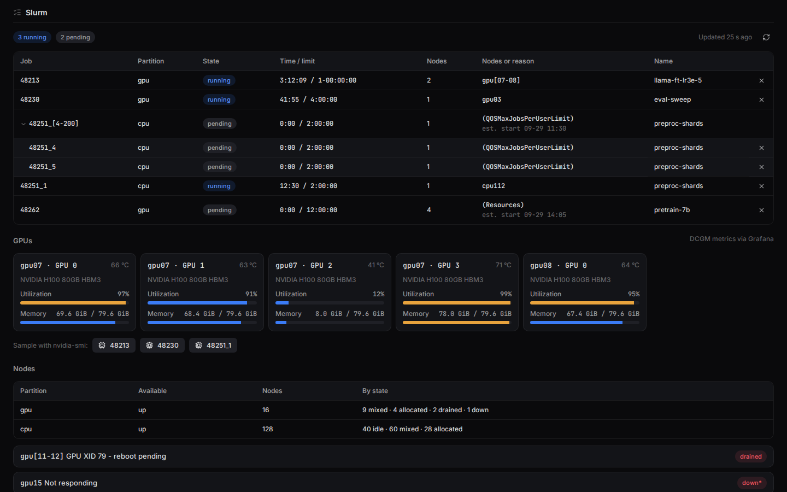
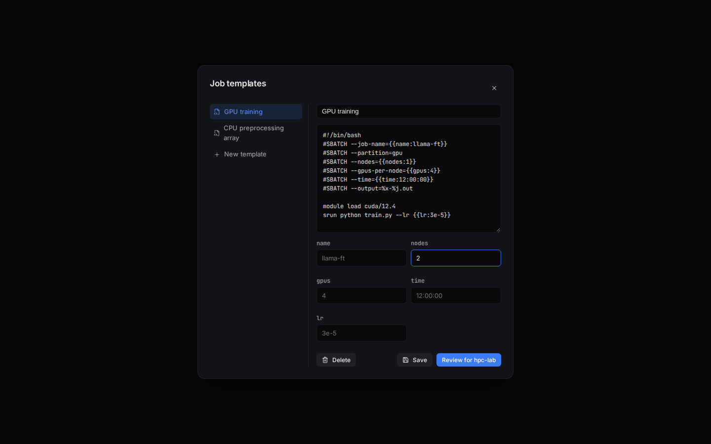
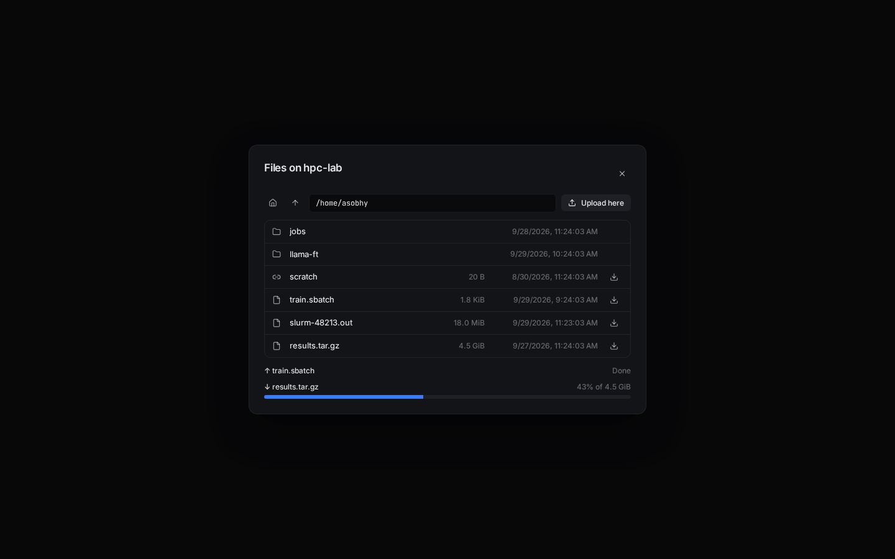
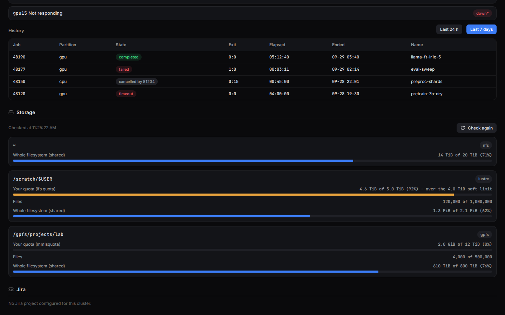

# Gate-H guide

Everything beyond the [README](../README.md): connecting to a cluster, features, everyday use,
troubleshooting and developer notes.

**Jump to:** [Quick start](#-quick-start) · [Everyday use](#everyday-use) · [Troubleshooting](#troubleshooting) · [Features](#features) · [Roadmap](#roadmap) · [For developers](#for-developers) · [Documentation](#documentation)

## 🚀 Quick start

**① Install.** Pick your system. Both build with the same command: `./build-desktop.sh`.

- **Linux:** you need [Docker](https://docs.docker.com/engine/install/). The script builds inside
  a container, so nothing else has to be installed.

  ```bash
  git clone git@github.com:AhmedYousriSobhi/gate-h.git && cd gate-h
  ./build-desktop.sh && ./dist/Gate-H-*.AppImage
  ```

- **macOS** (Apple Silicon or Intel): you need [Node.js](https://nodejs.org) 22 (`nvm install 22`
  or `brew install node@22`; the repo's `.nvmrc` says 22, which CI tests) and Xcode's Command Line
  Tools (`xcode-select --install`). Docker isn't used, because a
  Mac app can only be built on a Mac. The script builds for your Mac's own chip.

  ```bash
  git clone git@github.com:AhmedYousriSobhi/gate-h.git && cd gate-h
  ./build-desktop.sh && open dist/*.dmg
  ```

  Drag Gate-H to **Applications**. The app isn't notarized yet, so macOS blocks the first
  launch: open **System Settings → Privacy & Security** and click **Open Anyway**, or run
  `xattr -dr com.apple.quarantine /Applications/Gate-H.app`.

  Don't want to build? Download the `.dmg` for your chip (`arm64` is Apple Silicon, `x64` is
  Intel) from the [Releases page](https://github.com/AhmedYousriSobhi/gate-h/releases) once a
  version is tagged. Until then, signed-in GitHub users can take `Gate-H-macos-arm64` or
  `Gate-H-macos-x64` from the latest
  [macOS workflow run](https://github.com/AhmedYousriSobhi/gate-h/actions/workflows/macos.yml).
  A later run of `./build-desktop.sh` skips the slow dependency install when nothing changed.

  `tsh` and `az` installed with Homebrew are found even when Gate-H is started from the Dock.
  Teleport login needs `python3`, which comes with the Command Line Tools.

**② Add a cluster.** Click **+ Add**, give it a name, fill in *SSH connection* (see below), and
click **Save cluster**. Already have clusters in `~/.ssh/config`? Click the import icon next to
**+ Add** instead and pick which hosts to bring in: host, port, username and identity file carry
over (private key if the entry has one, SSH agent otherwise). A `ProxyJump`/`ProxyCommand` entry
is flagged, not imported - add its jump host by hand afterward.

**③ Open it.** Click the cluster in the sidebar. Its terminal and status open side by side.

### How do you reach your cluster?

Pick the way you'd normally connect, and open it to see what to fill in.

<details>
<summary><b>🔑 Directly</b> — <code>ssh user@host</code></summary>

<br/>

| Field | Enter |
|---|---|
| **Host** / **Port** | the login node, e.g. `login.hpc.example.org` / `22` |
| **Username** | your cluster username |
| **Auth method** | **Private key** (path + passphrase), **Password**, or **SSH agent** |

Passwords and passphrases are encrypted with your OS keychain. The first time you connect,
Gate-H remembers the server's host key and warns you if it ever changes.

</details>

<details>
<summary><b>🪜 Through a jump host</b> — <code>ssh -J jump user@host</code></summary>

<br/>

1. Fill in the login node as for **Directly**.
2. Tick **Connect through a jump/bastion host**, then enter the jump host's address, port,
   username and auth method.

A jump host can reuse the cluster's password or passphrase only if both use the same auth method.

</details>

<details>
<summary><b>☁️ Through Azure</b> — Azure Bastion or <code>az ssh vm</code></summary>

<br/>

**You need:** the [Azure CLI](https://learn.microsoft.com/cli/azure/install-azure-cli) (`az`), and
either Azure Bastion (Standard/Premium SKU, *Native client support* on) or a VM you can reach with
`az ssh vm`.

1. Under *SSH connection*, enter the tunnel's **far end**, not `127.0.0.1`: the target VM
   (Bastion), or the login node as the VM sees it (`az ssh vm`). Leave the jump host unticked.
2. Tick **Azure tunnel** and fill in:

   | Field | Enter |
   |---|---|
   | **Tunnel through** | Azure Bastion, or VM via `az ssh vm` |
   | **Local port** | any free port, e.g. `2222` |
   | **Subscription** | click **Load from az** and pick one |
   | **Resource group** | the Bastion's or VM's resource group |
   | **Bastion name** + **Target VM resource ID** | Bastion only |
   | **VM name** (+ optional **Local VM user**) | `az ssh vm` only |

3. Select the cluster. If Azure needs you to sign in, the terminal shows a code to enter in your
   browser. Then it opens the tunnel and connects.

💡 Run your shell in `tmux new -A -s main` so a dropped connection doesn't lose your work.
More: [docs/AZURE.md](AZURE.md).

</details>

<details>
<summary><b>🛡️ Behind Teleport</b> — <code>tsh login</code> then <code>tsh ssh user@node</code></summary>

<br/>

**You need:** the Teleport client (check with `tsh version`), and from your admin the proxy
address, your Teleport user, and the node name. First time with a password? Open your invite link,
set a password, and scan the QR code into an authenticator app.

1. Tick **Behind Teleport** and fill in:

   | Field | Enter |
   |---|---|
   | **Proxy address** | e.g. `teleport.example.com:443` |
   | **Teleport user** | only if it differs from your OS username |
   | **Leaf cluster** / **Auth connector** | only if your admin gave you one |
   | **Teleport node name** | the node as `tsh ls` shows it, e.g. `slogin1` |
   | **Login** | your Linux account on that node |
   | **Skip certificate verification** | only for a self-signed/lab proxy - see below |

2. Select the cluster:
   - **Already logged in:** your shell opens straight away.
   - **Not logged in:** the terminal shows **Teleport login needed**. Click **Log in**, then
     finish single sign-on in your browser, or enter your password and 6-digit code. Every
     cluster behind the same proxy reconnects.
3. About 15 minutes before your login expires, you get a notification and a **Renew** button in
   the terminal's status bar, so you can renew it whenever suits you.

💡 Proxy uses your organisation's own CA? Set `SSL_CERT_FILE=/path/to/ca.pem` (exporting it in your
shell profile is enough on macOS - Gate-H picks it up at startup the same way it does `PATH`).
Proxy is self-signed (a lab/test cluster with no real CA) instead? Tick **Skip certificate
verification** in the form.
More: [docs/TELEPORT.md](TELEPORT.md).

</details>

## Why Gate-H

If you look after more than one HPC cluster, you know the routine: a terminal for each login
node, a Grafana tab for each cluster's dashboards, a Jira board somewhere else. Then the VPN
drops, and you have to work out which of those things are still alive.

Gate-H puts all of that in one desktop window. You register each cluster once, with its SSH
access, its Grafana dashboards and its Jira project. After that:

- every cluster sits in a sidebar, with a light showing whether it's reachable,
- clicking a cluster opens its terminal and its status side by side,
- one notification feed tells you when anything changes on any cluster.

It's a single-user app with no server to set up. It's also careful with shared infrastructure:
reconnects are limited and spaced out, so a cluster that's down never gets flooded with
connection attempts. Secrets are encrypted on disk.

## Features

- 🖥️ **All your clusters in one sidebar.** Each has its own SSH settings: password, key or
  agent, with an optional jump host. Already have hosts in `~/.ssh/config`? Import them instead of
  retyping.
- 🟢 **Live reachability, with latency.** A light per cluster, checked in the background and
  re-checked as soon as the window regains focus; hover it for the last probe's round-trip time.
- ⌨️ **Built-in terminal.** Host keys are remembered on first use. Dead connections are
  detected, reconnects are limited and spaced out, and the terminal makes it obvious when a
  session isn't live. Search the scrollback, and click links to open them.
- 📜 **Per-session connection log.** Every step of a session's connect/reconnect/disconnect
  history, timestamped, in a popover from the terminal's header - handy for seeing what actually
  happened to a session you weren't watching.
- ✂️ **Command snippets.** Save commands you run often and insert them into the active terminal
  from a popover, without retyping or hunting through shell history.
- 🗔 **Multiple sessions per cluster, VS Code-style.** Open as many terminal sessions as you
  need, each named after what its shell reports (like `user@host: ~/logs`) and with its own live
  status dot. Rename them, reorder them, and drag them together to
  watch several at once. Arrange them in any grid, such as two side by side above a third: drag a
  tab, or a session's header bar, onto an edge of another session to place it there, then drag
  the borders between sessions to resize them.
- ☁️ **Azure clusters.** For clusters behind Azure Bastion or `az ssh vm`, Gate-H signs in with
  the Azure CLI and opens the tunnel for you.
- 🛡️ **Teleport clusters.** For clusters behind a Teleport proxy, Gate-H checks your `tsh`
  session and connects with `tsh ssh`. If you need to log in, you do it right in the terminal.
- 📊 **Grafana status.** Health checks plus live panels you choose, stacked or side by side.
- 📋 **Slurm jobs and nodes.** Your jobs (or everyone's in the partitions you name), with state,
  time used and why a pending job is waiting, plus each partition's node states and why nodes
  were drained. Runs `squeue`/`sinfo` on the session you already have open, only while you're
  looking at it. Your finished jobs from the last day or week, with exit codes, are one click
  away.
- 🎛️ **GPU usage.** Utilization, memory and temperature of every GPU your running jobs are on,
  from your cluster's DCGM metrics in Grafana, or sampled with `nvidia-smi` inside a job when you
  ask.
- 📝 **Job templates.** Keep batch scripts with `{{placeholders}}`, fill them in, review the
  result, and submit it with `sbatch`. Cancel your own jobs from the queue. Both ask you to confirm
  first.
- 📁 **File transfer.** Browse a cluster's files, and download or upload them with progress, over
  the connection your terminal already has. Click the folder icon above the cluster's panes.
- 💾 **Storage quota.** Home and scratch usage per path: the whole filesystem, and your own quota
  on Lustre and GPFS, flagged when you're over the soft limit. Checked when you ask.
- 🎫 **Jira, Cloud or Data Center.** List a cluster's issues and file new ones from its view.
- 🧩 **Widgets side by side.** Show, hide, swap, stack and resize the terminal and status views.
  Your layout is remembered.
- 🔔 **One notification feed.** Reachability changes, Jira activity and dropped sessions from
  every cluster, plus, if you turn it on, your Slurm jobs finishing or starting and nodes going
  down. Click one to jump to it.
- 🗂️ **Profiles and an overview.** Group clusters into profiles such as "Work" and "Research".
  The home screen shows every cluster in the current profile.
- ⏸️ **Switch clusters without losing work.** Every cluster you open keeps its sessions connected
  in the background, quietly, until you close it. Or put a cluster in standby so it makes no
  connections at all.

## Roadmap

The HPC features are in: Slurm jobs and nodes, job history, notifications, GPU usage, storage
quota, file transfer and job templates. They haven't yet been tried against real Slurm, Lustre,
GPFS or DCGM installations, so feedback from real clusters is the next step. After that:

- 🛡️ **File transfer on Teleport clusters**, through `tsh scp`.
- 🧮 **PBS and LSF**, if someone needs them. Only Slurm is supported today.

All of these features share the same rules: they never open a connection of their own, and never
log in for you. They only poll while you're looking at them (or, if you turn on notifications,
every few minutes for a cluster you have open), so they add almost no load to the cluster. Details:
[docs/HPC_ORCHESTRATION.md](HPC_ORCHESTRATION.md).

## Preview

<p align="center">
  <br/>
  <sub>The default view: every cluster in the active profile, with reachability, tags,
  integrations, and unread notifications at a glance.</sub>
</p>

<p align="center">
  <br/>
  <sub>A cluster's Terminal and Status side by side, not tabs - toggle, swap, or stack them from
  the toolbar.</sub>
</p>

<table>
<tr>
<td width="50%" align="center">
  <br/>
  <sub>Toggle widgets on/off; disabled entries preview what's planned next</sub>
</td>
<td width="50%" align="center">
  <br/>
  <sub>One bell for reachability, Jira, and session events across every cluster</sub>
</td>
</tr>
<tr>
<td width="50%" align="center">
  <br/>
  <sub>Register a cluster: SSH, optional jump host, Grafana, Jira</sub>
</td>
<td width="50%" align="center">
  <br/>
  <sub>Switch profiles, or add/rename/delete one, from the sidebar</sub>
</td>
</tr>
</table>

<p align="center">
  <br/>
  <sub>A cluster's Slurm jobs, with a job array expanded, the GPUs its running jobs are on (from
  DCGM metrics in Grafana), and each partition's node states.</sub>
</p>

<table>
<tr>
<td width="50%" align="center">
  <br/>
  <sub>Job templates: fill in the placeholders, review, and submit with sbatch</sub>
</td>
<td width="50%" align="center">
  <br/>
  <sub>Browse and transfer files over the terminal's connection</sub>
</td>
</tr>
<tr>
<td colspan="2" align="center">
  <br/>
  <sub>Job history from sacct, and storage usage with your Lustre and GPFS quotas</sub>
</td>
</tr>
</table>


### Procedures

<table>
<tr>
<td align="center">
  <b>Add a cluster</b><br/><br/>
  
</td>
<td align="center">
  <b>Connect over SSH</b><br/><br/>
  
</td>
<td align="center">
  <b>Status + file a Jira ticket</b><br/><br/>
  
</td>
</tr>
</table>

> These were captured by driving the real UI code in a headless browser against sample data (this
> environment can't open an actual Electron window) — see [docs/STATUS.md](STATUS.md) for
> exactly how, and what's still unverified against real infrastructure.


## Everyday use

| I want to… | Do this |
|---|---|
| see all clusters at a glance | Open **Overview** at the top of the sidebar |
| add clusters already in `~/.ssh/config` | Click the import icon next to **+ Add** in the sidebar |
| insert a saved command | Click the snippet icon in the terminal header, then the snippet |
| save/edit/delete snippets | Click the snippet icon → **Manage snippets** |
| see what happened to a session that dropped | Click the **Connection log** (clock) icon in the terminal header |
| check a cluster's latency | Hover its reachability light in the sidebar or Overview |
| see my Slurm jobs and node states | Edit the cluster → tick **Slurm jobs and nodes**; they show in its Status. Click ▸ on a job array to list its tasks |
| copy files to or from a cluster | Click the folder icon above its panes: open folders, **↓** to download, **Upload here** to upload |
| submit a batch job | Click the code icon above the cluster's panes, pick or write a template, fill it in, **Review**, then **Submit** and confirm |
| cancel one of my jobs | Click **×** on its row in the Slurm queue and confirm |
| rearrange a cluster's widgets | Use the toolbar above them; the puzzle-piece icon shows or hides each one |
| see what changed anywhere | Click the 🔔 bell; click an entry to jump to that cluster |
| separate work and research clusters | Click the profile name at the top of the sidebar |
| keep a session alive in the background | Nothing to do: switching clusters never closes sessions |
| end a cluster's sessions | Hover it in the sidebar → **×** (click again to confirm if sessions are live) |
| stop all connections to a cluster | Hover it → **power** icon (standby); select it → **Resume monitoring** to restart |
| open another terminal session | Click **+** above the session tabs |
| watch two sessions at once | Click the split icon next to **+**, or press **Ctrl+Shift+5** (**Cmd+\\** on macOS) in a terminal |
| put a session beside, above or below another | Drag its tab or its header bar onto that edge of the other session; the highlighted half shows where it lands |
| resize sessions shown together | Drag the border between them |
| reorder tabs, or stack two into one view | Drag a tab onto the edge of another tab to reorder, or onto its middle to stack them |
| widen or narrow the side list of sessions | Drag the line between the list and the sessions; double-click it to reset |
| move tabs between the side and the top | Click **⋯** above the tabs → **Tabs position** |
| rename, split, unstack or close a session | Right-click its tab or the session itself (or double-click the tab to rename) |
| focus on one session in a stack for a while | Click **Maximize** in its header; **Restore** brings the layout back |
| split or close a session from where you're looking | Use the icons on the right of its header bar |

**Terminal shortcuts:** **Ctrl+Shift+C** / **Ctrl+Shift+V** copy and paste (plain **Ctrl+C**
still interrupts). **Ctrl+F** searches the scrollback. **Ctrl+Tab** / **Ctrl+Shift+Tab** switch
sessions. **Ctrl+Shift+5** splits.

On macOS: **Cmd+C** / **Cmd+V** copy and paste, **Cmd+F** searches and **Cmd+\\** splits.
**Ctrl+Tab** still switches sessions, since Cmd+Tab switches apps. Every other Ctrl key goes to
the shell.

## Troubleshooting

| Problem | Try |
|---|---|
| The light stays red | Check your VPN, and that you can reach the host (or Teleport proxy) from this machine. |
| The terminal says *Paused* | Gate-H stopped retrying to spare the cluster. Click **Reconnect now**, or wait: it resumes by itself when the light turns green. A session that dropped while its cluster was in the background reconnects when you select the cluster. |
| *Host key … changed* notification | The server's key changed since your last connection. Ask your cluster admin before trusting it. |
| Azure: a sign-in code appears | Your Azure login expired. Open the link and enter the code. |
| macOS: *"Gate-H" can't be opened because Apple cannot check it* | The app isn't notarized. Go to **System Settings → Privacy & Security → Open Anyway**, or run `xattr -dr com.apple.quarantine /Applications/Gate-H.app`. |
| Build fails with *unable to get local issuer certificate* | Your network re-signs HTTPS with its own certificate, which Node doesn't trust. `./build-desktop.sh` checks this first and retries with the macOS keychain by itself (Node 22.15+ or 24). If it still fails, run `NODE_EXTRA_CA_CERTS=/path/to/ca.pem ./build-desktop.sh` with your organisation's CA file; the script's error message shows how to export the Mac's CAs to one. |
| macOS build fails at the dmg with *hdiutil: couldn't unmount … Resource busy* | Something (Spotlight, a Finder window, a security agent) is holding the temporary disk image. `./build-desktop.sh` detaches it and retries up to three times. If it still fails, `dist/Gate-H-*-mac.zip` is already complete: unzip it and drag Gate-H to Applications. |
| macOS: `tsh` or `az` not found | Install it with Homebrew. Gate-H reads your login shell's PATH, so a restart of Gate-H after installing is enough. |
| macOS: Teleport login does nothing or fails at once | It needs `python3`. Run `xcode-select --install`. |
| Teleport: *unreachable* or *no route to host* | Your machine can't reach the proxy. Check the VPN and the proxy address. |
| Teleport: *certificate signed by unknown authority* | Real organisation CA: set `SSL_CERT_FILE` (macOS: exporting it in your shell profile and restarting Gate-H is enough) pointing at it. Self-signed/lab proxy with no real CA: tick **Skip certificate verification** on the cluster instead. |
| Teleport: *login needed* on a cluster in the background | Background clusters never log in on their own. Log in from any cluster on that proxy; the rest reconnect. |
| Teleport: *access denied* | Your Teleport role doesn't allow that login or node. Run `tsh status` to see your logins. |

## For developers

### Run from source

```bash
npm install       # Node.js 20+; also builds the native modules for Electron
npm run dev       # start Gate-H with hot reload
```

This works the same on Linux and macOS. To build the packaged app, use `./build-desktop.sh` (see
[Quick start](#-quick-start)); CI runs it on macOS for both chips
([macos.yml](../.github/workflows/macos.yml)).

Before opening a pull request, run `npm run typecheck`, `npm run lint` and `npm run build`. To
test a single part: `./scripts/test-azure-tunnel.sh`, `./scripts/test-teleport.sh` and
`node scripts/test-pty-manager.mjs`.

### How it's built

Gate-H is an Electron app with three strictly separated processes:

```
src/
  shared/     # types shared by all processes, incl. the GateHApi contract for window.api
  main/       # main process: SQLite store, SSH and PTY sessions, Grafana/Jira clients,
              # background monitors, one IPC handler file per namespace
  preload/    # the only bridge: a contextBridge API exposed as window.api
  renderer/   # React UI, grouped by feature: shell, terminal, status, clusters
```

- **The renderer has no Node or Electron access.** Everything goes through `window.api`, defined
  in [src/shared/types.ts](../src/shared/types.ts).
- **Secrets are write-only.** They're encrypted with `electron.safeStorage` (your OS keychain),
  and the renderer only ever learns whether one is set.
- **State lives in SQLite** (`better-sqlite3`). Migrations only add columns and run at every
  launch.
- **Terminals** are rendered with `@xterm/xterm`. SSH and Azure clusters use an `ssh2` channel.
  Teleport clusters run `tsh ssh` on a local pseudo-terminal (`node-pty`), because `ssh2` can't do
  Teleport's certificate auth.
- **Fonts and icons ship with the app,** so the UI never needs the network just to render.

### Contributing

Each change starts as a GitHub issue and gets its own branch and pull request. [CLAUDE.md](../CLAUDE.md)
has the commands, the code map, the conventions and the known gotchas.

## Documentation

| Document | What's in it |
|---|---|
| [docs/TELEPORT.md](TELEPORT.md) | Teleport clusters: the session check, login, routing, and testing. |
| [docs/AZURE.md](AZURE.md) | Azure tunnels: how they stay alive, investigating drops, the script on its own, and testing. |
| [docs/JIRA_GUIDE.md](JIRA_GUIDE.md) | Jira setup, and keeping several clusters' tickets apart in one project. |
| [docs/HPC_ORCHESTRATION.md](HPC_ORCHESTRATION.md) | Planned Slurm job queue, node health, GPU telemetry, file transfer and job submission: design and phases. |
| [docs/STATUS.md](STATUS.md) | What's shipped, how each feature was verified, known limitations, and the roadmap. |
| [SPEC.md](../SPEC.md) | The functional spec, written as requirements. |
| [docs/ANALYSIS.md](ANALYSIS.md) | Prior art (Open OnDemand, ColdFront/XDMoD, Slurm-web, …) and the reasons behind the design. |
| [CHANGELOG.md](../CHANGELOG.md) | Every change, in order, and why. |

## License

[MIT](../LICENSE) © 2026 Ahmed Yousri Sobhi
